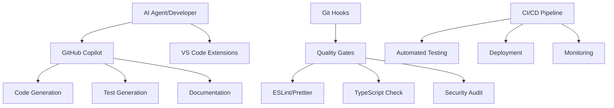

# AI Agents & Development Automation

> **📋 Quick Reference Guide for AI-Assisted Development**
>
> This document provides comprehensive instructions for AI agents (GitHub Copilot, ChatGPT, etc.) when working on the **3D Inventory API** project. For UI-specific guidance, see [3D Inventory UI AGENTS.md](../3d-inventory-ui/AGENTS.md).

## 📑 Table of Contents

1. [Overview](#overview)
2. [AI Integration Guidelines](#ai-integration-guidelines)
3. [Cross-Project Documentation](#cross-project-documentation)
4. [GitHub Copilot Integration](#github-copilot-integration)
5. [AI-Assisted Development Workflow](#ai-assisted-development-workflow)
6. [Automated Quality Gates](#automated-quality-gates)
7. [Testing Automation](#testing-automation)
8. [Test Verification & Quality Assurance](#test-verification--quality-assurance)
9. [Documentation Generation](#documentation-generation)
10. [Code Analysis & Optimization](#code-analysis--optimization)
11. [Deployment Automation](#deployment-automation)
12. [Monitoring & Alerting](#monitoring--alerting)
13. [Best Practices](#best-practices)
14. [Resource Links](#resource-links)

---

## Overview

The **3D Inventory API** (`3d-inventory-api`) leverages advanced AI agents and automation tools to enhance development productivity, code quality, and system reliability. This backend API serves as the foundation for the Angular UI frontend.

### 🎯 **Key AI Capabilities**

- **Code Generation**: TypeScript services, controllers, and middleware with proper typing
- **Test Automation**: Comprehensive Jest test suites with >80% coverage
- **Documentation**: Auto-generated API specs, JSDoc, and technical guides
- **Quality Assurance**: Automated linting, type checking, and security scanning
- **Deployment**: CI/CD pipeline automation with Google Cloud integration

### 🏗️ **Architecture Components**



---

## AI Integration Guidelines

### 🤖 **How AI Agents Should Use This Document**

**Primary Use Case**: When an AI agent (GitHub Copilot, ChatGPT, etc.) is asked to work on this project, it should:

1. **Read this file first** to understand project structure and standards
2. **Reference linked documentation** for specific implementation details
3. **Follow file organization rules** from [file-organization.instructions.md](.github/instructions/file-organization.instructions.md)
4. **Apply code quality standards** from [code_quality_standards.instructions.md](.github/instructions/code_quality_standards.instructions.md)
5. **Generate tests according to** [test_coverage_standards.instructions.md](.github/instructions/test_coverage_standards.instructions.md)

### 📋 **AI Decision Tree**

```
AI Agent Task Request
│
├─ Creating New Files?
│  └─ Read: .github/instructions/file-organization.instructions.md
│     └─ Place files in correct subfolder (scripts/, config/, docs/, src/)
│
├─ Writing Code?
│  └─ Read: .github/instructions/code_quality_standards.instructions.md
│     └─ Apply TypeScript strict mode, ESLint rules, JSDoc standards
│
├─ Writing Tests?
│  └─ Read: .github/instructions/test_coverage_standards.instructions.md
│     └─ Generate comprehensive test suites (>80% coverage)
│
├─ Working with TypeScript?
│  └─ Read: .github/instructions/typescript_strict_mode.instructions.md
│     └─ Use strict mode, explicit types, no 'any'
│
├─ Security-Related Code?
│  └─ Read: .github/instructions/snyk_rules.instructions.md
│     └─ Follow security best practices, no hardcoded secrets
│
└─ Cross-Project Work (API + UI)?
   └─ Read: docs/troubleshooting/archive/AI-TESTING-INTEGRATION.md
    └─ Coordinate testing and integration patterns
```

---

## Cross-Project Documentation

### 🔗 **Related Projects**

This API works in conjunction with the Angular UI. AI agents should be aware of:

| Project         | Repository                                                                                        | AGENTS.md                                                                  |
| --------------- | ------------------------------------------------------------------------------------------------- | -------------------------------------------------------------------------- |
| **Backend API** | [3d-inventory-api](https://github.com/karol-preiskorn/3d-inventory-mongo-api)                    | [AGENTS.md](./AGENTS.md) *(this file)*                                    |
| **Angular UI**  | [3d-inventory-ui](https://github.com/karol-preiskorn/3d-inventory-angular-ui)                    | [UI AGENTS.md](../3d-inventory-ui/AGENTS.md)                               |
| **Integration** | Cross-project testing and coordination                                                            | [AI-TESTING-INTEGRATION.md](docs/troubleshooting/archive/AI-TESTING-INTEGRATION.md) |

### 📚 **Essential Documentation References**

#### **For AI Agents: Always Reference These Files**

1. **[File Organization](.github/instructions/file-organization.instructions.md)** - Where to create new files
2. **[Code Quality Standards](.github/instructions/code_quality_standards.instructions.md)** - TypeScript, ESLint, testing rules
3. **[Test Coverage Standards](.github/instructions/test_coverage_standards.instructions.md)** - Test generation requirements
4. **[TypeScript Strict Mode](.github/instructions/typescript_strict_mode.instructions.md)** - Type safety requirements
5. **[Security Rules](.github/instructions/snyk_rules.instructions.md)** - Security scanning and best practices

#### **For Development Workflow**

- **[DEVELOPMENT.md](DEVELOPMENT.md)** - Complete development setup and workflow
- **[JEST-TESTING.md](JEST-TESTING.md)** - Comprehensive Jest testing guide
- **[MODERN-JEST-SETUP.md](MODERN-JEST-SETUP.md)** - Modern Jest configuration
- **[SECURITY.md](SECURITY.md)** - Security policies and authentication

#### **For Deployment & Infrastructure**

- **[README-GCP.md](docs/guides/README-GCP.md)** - Google Cloud deployment guide
- **[Dockerfile](Dockerfile)** - Container configuration
- **[package.json](package.json)** - NPM scripts and dependencies

---

## GitHub Copilot Integration

### 🤖 **Primary Use Cases for Backend Development**

#### **1. API Endpoint Generation**

```typescript
// AI-generated REST API endpoint with proper typing
import { Request, Response, NextFunction } from 'express'
import { UserService } from '../services/UserService'
import { CreateUserRequest, User } from '../models/User'
import { successResponse, errorResponse } from '../utils/errors'

export const createUser = async (req: Request, res: Response, next: NextFunction): Promise<void> => {
  try {
  const userData: CreateUserRequest = req.body
  const userService = UserService.getInstance()
  const newUser: User = await userService.createUser(userData)
  res.status(201).json(successResponse(newUser, 'User created successfully'))
  } catch (error) {
  next(error)
  }
}
```

**AI Instruction**: When generating API endpoints:

- Use **Express.js** request/response types
- Implement **error handling** with try-catch
- Follow **singleton pattern** for services
- Return **standardized responses** using utility functions
- Apply **proper HTTP status codes**

#### **2. Service Layer Implementation**

```typescript
// AI-generated service with business logic
import { Collection, Db, ObjectId } from 'mongodb'
import { User, CreateUserRequest } from '../models/User'
import { ValidationError, DatabaseError } from '../utils/errors'
import bcrypt from 'bcrypt'

export class UserService {
  private static instance: UserService

  private constructor() {}

  public static getInstance(): UserService {
  if (!UserService.instance) {
    UserService.instance = new UserService()
  }
  return UserService.instance
  }

  async createUser(userData: CreateUserRequest): Promise<User> {
  // Validate input
  if (!userData.username || !userData.email || !userData.password) {
    throw new ValidationError('Username, email, and password are required')
  }

  // Hash password
  const hashedPassword = await bcrypt.hash(userData.password, 12)

  // Create user in database
  // ... implementation
  }
}
```

**AI Instruction**: When generating services:

- Use **singleton pattern** for service instances
- Implement **input validation** before database operations
- Use **bcrypt** for password hashing (12 rounds)
- Follow **MongoDB best practices** with proper typing
- Include **comprehensive error handling**

#### **3. Middleware Generation**

```typescript
// AI-generated authentication middleware
import { Request, Response, NextFunction } from 'express'
import jwt from 'jsonwebtoken'
import config from '../utils/config'
import { UnauthorizedError } from '../utils/errors'

export const authenticateToken = (req: Request, res: Response, next: NextFunction): void => {
  const authHeader = req.headers['authorization']
  const token = authHeader && authHeader.split(' ')[1]

  if (!token) {
  return next(new UnauthorizedError('Access token required'))
  }

  try {
  const user = jwt.verify(token, config.JWT_SECRET)
  req.user = user
  next()
  } catch (error) {
  next(new UnauthorizedError('Invalid or expired token'))
  }
}
```

**AI Instruction**: When generating middleware:

- Use **proper Express middleware signature**
- Implement **JWT token validation**
- Add **user context to request object**
- Use **custom error classes** for error handling
- Include **TypeScript type definitions**

### 🧪 **Test Generation**

#### **Comprehensive Test Suites**

```typescript
// AI-generated comprehensive test suite
import { UserService } from '../services/UserService'
import { ValidationError, DatabaseError } from '../utils/errors'

describe('UserService', () => {
  let userService: UserService
  let mockRepository: jest.Mocked<UserRepository>

  beforeEach(() => {
  jest.clearAllMocks()
  mockRepository = createMockRepository()
  userService = new UserService(mockRepository)
  })

  describe('createUser', () => {
  it('should create user with hashed password', async () => {
    // Test implementation following test_coverage_standards.instructions.md
  })

  it('should throw ValidationError for invalid email', async () => {
    // Error scenario testing
  })

  it('should handle database errors gracefully', async () => {
    // Database error handling
  })
  })
})
```

**AI Instruction**: When generating tests:

- Follow **[test_coverage_standards.instructions.md](.github/instructions/test_coverage_standards.instructions.md)**
- Achieve **>80% code coverage** (>90% for services)
- Include **happy path, error cases, and edge cases**
- Use **proper mocking** with Jest
- Follow **AAA pattern** (Arrange, Act, Assert)

For comprehensive test examples, reference:

- **[authentication.service.spec.ts](../3d-inventory-ui/src/app/services/authentication.service.spec.ts)** - 50+ test cases
- **[test-db-auth.ts](scripts/testing/test-db-auth.ts)** - Database authentication testing

---

## AI-Assisted Development Workflow

### 📋 **Development Phases with AI Integration**

#### **Phase 1: Planning & Architecture**

```typescript
// AI assists with architecture planning
/*
 * AI Agent Prompt Example:
 * "Following the patterns in AGENTS.md, create a new service for managing
 * device connections with:
 * - CRUD operations
 * - Connection validation
 * - Proper error handling
 * - >90% test coverage
 * Apply #code_quality_standards and #typescript_strict_mode"
 */
```

**AI Instruction**: When planning features:

1. Read **[DEVELOPMENT.md](DEVELOPMENT.md)** for workflow
2. Reference **existing service patterns** in `src/services/`
3. Plan **database schema** with MongoDB best practices
4. Design **API endpoints** following REST conventions
5. Outline **test scenarios** before implementation

#### **Phase 2: Implementation**

**AI Workflow**:

1. **Generate boilerplate code** following project patterns
2. **Apply TypeScript strict mode** from [typescript_strict_mode.instructions.md](.github/instructions/typescript_strict_mode.instructions.md)
3. **Implement business logic** with proper error handling
4. **Add comprehensive JSDoc** documentation
5. **Generate tests** following [test_coverage_standards.instructions.md](.github/instructions/test_coverage_standards.instructions.md)

**Example AI Prompt**:

```
"Following AGENTS.md and code_quality_standards.instructions.md, create a new
ConnectionService at src/services/ConnectionService.ts that:
- Manages device connections in MongoDB
- Implements singleton pattern
- Includes CRUD operations with proper typing
- Has comprehensive error handling
- Follows existing service patterns from UserService.ts"
```

#### **Phase 3: Quality Assurance**

**Automated Quality Checks**:

```bash
# AI-triggered quality verification
npm run check:quality    # Runs lint + type check + tests
npm run test:coverage   # Validates >80% coverage threshold
npm run lint:fix        # Auto-fixes ESLint issues
```

**AI Instruction**: Before marking implementation complete:

1. Run **all quality checks** and fix issues
2. Verify **test coverage** meets thresholds
3. Ensure **TypeScript strict mode** compliance
4. Check **security vulnerabilities** with `npm audit`
5. Update **documentation** if needed

#### **Phase 4: Documentation**

**AI-Generated Documentation**:

```typescript
/**
 * @file ConnectionService.ts
 * @description Service for managing device connections with validation and error handling
 * @module services
 *
 * @example
 * ```typescript
 * const connectionService = ConnectionService.getInstance()
 * const connection = await connectionService.createConnection(connectionData)
 * ```
 */
export class ConnectionService {
  // Implementation
}
```

**AI Instruction**: When generating documentation:

- Use **JSDoc format** for all public methods
- Include **usage examples** in documentation
- Generate **API documentation** with OpenAPI specs
- Update **README.md** for new features
- Reference **related documentation** files

---

## Automated Quality Gates

### 🔒 **Pre-commit Automation**

```bash
# .husky/pre-commit - Automated quality checks
#!/bin/sh
npm run lint:fix        # ESLint auto-fix
npm run format         # Prettier formatting
npm run check:type     # TypeScript validation
npm run test:changed   # Tests for changed files
npm run security:audit # Security vulnerability check
```

**AI Instruction**: Quality gates enforce:

- **[Code Quality Standards](.github/instructions/code_quality_standards.instructions.md)** - ESLint, TypeScript, testing
- **[File Organization](.github/instructions/file-organization.instructions.md)** - Correct file placement
- **Security Scanning** - No hardcoded secrets, dependency vulnerabilities
- **Test Coverage** - Minimum 80% coverage threshold

### 🚀 **Pre-push Automation**

```bash
# .husky/pre-push - Comprehensive validation
#!/bin/sh
npm run test:full      # Complete test suite
npm run build         # Build verification
npm run lint:strict   # Strict linting rules
npm run coverage     # Test coverage validation
```

### 📊 **Quality Metrics**

AI agents should maintain:

| Metric              | Threshold | Reference                                                                        |
| ------------------- | --------- | -------------------------------------------------------------------------------- |
| **Code Coverage**   | >80%      | [test_coverage_standards.instructions.md](.github/instructions/test_coverage_standards.instructions.md) |
| **Type Safety**     | 100%      | [typescript_strict_mode.instructions.md](.github/instructions/typescript_strict_mode.instructions.md) |
| **ESLint Errors**   | 0         | [code_quality_standards.instructions.md](.github/instructions/code_quality_standards.instructions.md) |
| **Security Issues** | 0 High    | [snyk_rules.instructions.md](.github/instructions/snyk_rules.instructions.md)   |

---

## Testing Automation

### 🧪 **Test Categories**

#### **1. Unit Tests**

```typescript
// AI-generated unit test following standards
describe('AuthenticationService', () => {
  it('should authenticate admin user with valid credentials', async () => {
  // Arrange
  const loginRequest = { username: 'admin', password: 'admin123!' }

  // Act
  const result = await authService.login(loginRequest)

  // Assert
  expect(result.token).toBeDefined()
  expect(result.user.role).toBe('admin')
  })

  it('should handle rate limiting for excessive login attempts', async () => {
  // Edge case testing
  })
})
```

**AI Instruction**: Unit tests should:

- **Mock all external dependencies** (database, HTTP, file system)
- **Cover happy path, error cases, and edge cases**
- **Use descriptive test names** explaining scenario
- **Follow AAA pattern** (Arrange, Act, Assert)
- Reference **[test_coverage_standards.instructions.md](.github/instructions/test_coverage_standards.instructions.md)**

#### **2. Integration Tests**

```typescript
// AI-generated integration test
describe('User Management Integration', () => {
  it('should complete full user registration and login workflow', async () => {
  // Test complete workflow: register → login → access protected route
  })
})
```

#### **3. Database Authentication Tests**

```typescript
// Direct database testing - see scripts/testing/test-db-auth.ts
const TEST_CREDENTIALS = [
  { username: 'admin', password: 'admin123!' },
  { username: 'user', password: 'user123!' },
  { username: 'carlo', password: 'carlo123!' },
  { username: 'viewer', password: 'viewer123!' },
]

// Tests user existence, authentication, and role validation
```

**File Reference**: [test-db-auth.ts](scripts/testing/test-db-auth.ts)

### 🎯 **Test Coverage Requirements**

```json
{
  "coverageThreshold": {
  "global": {
    "statements": 80,
    "branches": 75,
    "functions": 85,
    "lines": 80
  },
  "src/services/": {
    "statements": 90,
    "branches": 80,
    "functions": 95,
    "lines": 90
  },
  "src/middlewares/": {
    "statements": 95,
    "branches": 85,
    "functions": 100,
    "lines": 95
  }
  }
}
```

**AI Instruction**: Critical paths require:

- **Authentication/Authorization**: 100% coverage
- **Database Operations**: 95% coverage
- **Security Functions**: 100% coverage

---

## Test Verification & Quality Assurance

### 🔍 **Automated Test Verification**

#### **API Backend Testing Commands**

```bash
# Core testing
npm test                    # Run full Jest test suite
npm run test:coverage      # Coverage reports (>80% threshold)
npm run test:watch         # Watch mode for development

# Authentication & Database
npm run test:db-auth       # Direct database authentication tests
npm run test:auth          # API authentication endpoint tests

# Quality assurance
npm run check:quality      # Lint + TypeScript + Tests combined
npm run test:git-hooks     # Test git hooks functionality
```

**AI Instruction**: Before deployment:

1. Run **`npm run check:quality`** - Complete quality gate
2. Verify **`npm run test:coverage`** - >80% coverage
3. Check **`npm run test:db-auth`** - Database authentication
4. Validate **`npm run build`** - Production build success

### 📁 **Test File Organization**

```
3d-inventory-api/
├── scripts/
│   └── testing/
│       └── test-db-auth.ts          # Database authentication tests
├── src/
│   ├── tests/
│   │   ├── testGenerators.ts        # Test data factories
│   │   └── testUtils.ts             # Testing utilities
│   ├── **/*.spec.ts                 # Unit/integration tests
│   └── utils/
│       └── tests.ts                 # Test helper functions
└── jest.config.ts                   # Jest configuration
```

**AI Instruction**: When creating test files:

- **Unit/integration tests** → `src/**/*.spec.ts`
- **Test utilities** → `src/tests/`
- **Database testing scripts** → `scripts/testing/`
- **Test data generators** → `src/tests/testGenerators.ts`

### 🚀 **AI-Enhanced Testing**

#### **Automated Test Generation Example**

```typescript
// AI generates comprehensive test scenarios
/*
 * AI Prompt:
 * "Following test_coverage_standards.instructions.md, generate comprehensive
 * tests for UserService with:
 * - Happy path scenarios
 * - Error handling (401, 403, 500, network errors)
 * - Input validation
 * - Edge cases (empty inputs, malformed data)
 * - Security scenarios (authentication, authorization)
 * Achieve >90% coverage for services"
 */

describe('UserService - AI Generated Tests', () => {
  // AI analyzes the service and generates:
  // ✅ Happy path tests
  // ✅ Edge cases
  // ✅ Error scenarios
  // ✅ Performance tests
  // ✅ Security validations
})
```

#### **Smart Test Execution**

```bash
# AI-enhanced testing metrics
npm run test:coverage            # Code coverage analysis
npm run test:performance         # Performance regression testing
npm run test:security           # Security vulnerability testing
npm run test:integration        # Full system integration validation
```

---

## Documentation Generation

### 📚 **Automated Documentation Types**

#### **1. API Documentation**

```typescript
/**
 * @openapi
 * /api/users:
 *   post:
 *     summary: Create a new user
 *     tags: [Users]
 *     requestBody:
 *       required: true
 *       content:
 *         application/json:
 *           schema:
 *             $ref: '#/components/schemas/CreateUserRequest'
 *     responses:
 *       201:
 *         description: User created successfully
 *         content:
 *           application/json:
 *             schema:
 *               $ref: '#/components/schemas/User'
 */
export const createUser = async (req: Request, res: Response): Promise<void> => {
  // Implementation
}
```

**AI Instruction**: Generate OpenAPI/Swagger specs with:

- **Request/response schemas** from TypeScript interfaces
- **Detailed descriptions** for all endpoints
- **Example requests and responses**
- **Authentication requirements**

#### **2. Code Documentation**

```typescript
/**
 * User Service - Manages user-related operations
 *
 * This service handles user CRUD operations, authentication, and authorization.
 * It implements a singleton pattern to ensure a single instance across the application.
 *
 * @class UserService
 * @singleton
 *
 * @example
 * ```typescript
 * const userService = UserService.getInstance()
 * const user = await userService.createUser({
 *   username: 'john.doe',
 *   email: 'john@example.com',
 *   password: 'SecurePass123!',
 *   role: 'user'
 * })
 * ```
 *
 * @see {@link CreateUserRequest} for user creation parameters
 * @see {@link User} for user entity structure
 */
export class UserService {
  // Implementation
}
```

**AI Instruction**: Include JSDoc for:

- **Class/interface descriptions**
- **Method parameters and return types**
- **Usage examples**
- **Cross-references** to related types/methods

#### **3. Workflow Documentation**

```bash
# Generate documentation
npm run docs:generate   # Generate all documentation
npm run docs:api       # API documentation only
npm run docs:deploy    # Deploy to documentation site
```

---

## Code Analysis & Optimization

### 🔍 **Static Analysis**

#### **ESLint Configuration**

```typescript
// eslint.config.ts - AI-recommended rules
export default [
  {
  files: ['**/*.ts'],
  rules: {
    '@typescript-eslint/no-unused-vars': 'error',
    '@typescript-eslint/explicit-return-types': 'warn',
    '@typescript-eslint/no-explicit-any': 'error',
    'prefer-const': 'error',
    'no-var': 'error',
    complexity: ['error', { max: 10 }],
  },
  },
]
```

**AI Instruction**: Code analysis includes:

- **Cyclomatic complexity** - Max 10 per function
- **Type safety** - No `any` types allowed
- **Code duplication** - Automated detection
- **Security vulnerabilities** - Automated scanning

### ⚡ **Optimization Automation**

```bash
# Automated optimization pipeline
npm run optimize:bundle    # Bundle size optimization
npm run optimize:deps      # Dependency optimization
npm run analyze:complexity # Code complexity analysis
npm run security:audit     # Security vulnerability scan
```

---

## Deployment Automation

### 🚀 **CI/CD Pipeline**

#### **GitHub Actions Workflow**

```yaml
# .github/workflows/deploy.yml
name: AI-Assisted Deployment
on:
  push:
  branches: [main]

jobs:
  quality-gate:
  runs-on: ubuntu-latest
  steps:
    - name: Checkout code
    uses: actions/checkout@v3

    - name: Setup Node.js
    uses: actions/setup-node@v3
    with:
      node-version: '18'

    - name: Install dependencies
    run: npm ci

    - name: Run quality checks
    run: npm run check:quality

    - name: Run tests with coverage
    run: npm run test:coverage

    - name: Security scan
    run: npm run security:scan

    - name: Build production
    run: npm run build

    - name: Deploy to GCP
    run: npm run gcp:deploy
```

### 🌐 **Google Cloud Deployment**

```yaml
# app.yaml - Google Cloud Run configuration
runtime: nodejs18

env_variables:
  NODE_ENV: production
  MONGODB_URI: ${MONGODB_URI}
  JWT_SECRET: ${JWT_SECRET}

automatic_scaling:
  min_instances: 1
  max_instances: 10
```

**AI Instruction**: Deployment includes:

- **Automated testing** before deployment
- **Security scanning** for vulnerabilities
- **Build verification** for production
- **Health checks** after deployment

---

## Monitoring & Alerting

### 📊 **Application Metrics**

```typescript
// AI-enhanced logging service
export class LogService {
  createLog(entry: LogEntry): Observable<Log> {
  return this.http.post<Log>('/api/logs', {
    ...entry,
    timestamp: new Date().toISOString(),
    context: this.generateContext(),
    severity: this.analyzeSeverity(entry),
  })
  }
}
```

**AI Instruction**: Monitoring includes:

- **Performance metrics** - Response times, throughput
- **Error tracking** - Automated detection and alerting
- **Resource utilization** - CPU, memory, network
- **User analytics** - Usage patterns and behavior

---

## Best Practices

### 🎯 **AI Agent Integration**

#### **Code Generation Guidelines**

1. **Review Generated Code**: Always review AI output for correctness
2. **Test Coverage**: Ensure >80% coverage for all generated code
3. **Documentation**: Generate comprehensive JSDoc for all public APIs
4. **Security Review**: Audit authentication/authorization code

#### **Quality Standards**

```typescript
// AI-assisted code should meet these standards
interface CodeQualityStandards {
  typeScript: 'strict' // 100% TypeScript strict mode
  testCoverage: '>80%' // Minimum test coverage
  documentation: 'comprehensive' // Full JSDoc coverage
  security: 'audited' // Security review required
  performance: 'optimized' // Performance benchmarked
}
```

### 📋 **Development Workflow**

#### **Daily Development Routine**

1. **Morning**: Run `npm run test:db-auth` to verify environment
2. **Development**: Use `npm run test:watch` for continuous feedback
3. **Pre-Commit**: Automated testing via git hooks
4. **Pre-Push**: Full test suite validation

#### **Quality Gates**

- **Minimum Coverage**: 80% code coverage required
- **Test Performance**: Tests must complete within 2 minutes
- **Integration Tests**: Must validate complete user workflows
- **Security Tests**: Authentication and authorization validation

---

## Resource Links

### 📚 **Essential Documentation**

#### **AI Instructions & Standards**

- **[File Organization](.github/instructions/file-organization.instructions.md)** - Where to create files
- **[Code Quality Standards](.github/instructions/code_quality_standards.instructions.md)** - TypeScript, ESLint, testing
- **[Test Coverage Standards](.github/instructions/test_coverage_standards.instructions.md)** - Test requirements
- **[TypeScript Strict Mode](.github/instructions/typescript_strict_mode.instructions.md)** - Type safety
- **[Security Rules](.github/instructions/snyk_rules.instructions.md)** - Security scanning

#### **Development Workflow**

- **[DEVELOPMENT.md](DEVELOPMENT.md)** - Complete development setup
- **[JEST-TESTING.md](JEST-TESTING.md)** - Jest testing guide
- **[MODERN-JEST-SETUP.md](MODERN-JEST-SETUP.md)** - Modern Jest config
- **[SECURITY.md](SECURITY.md)** - Security policies

#### **Deployment & Infrastructure**

- **[README-GCP.md](docs/guides/README-GCP.md)** - Google Cloud deployment
- **[Dockerfile](Dockerfile)** - Container configuration
- **[package.json](package.json)** - NPM scripts

### 🔗 **Cross-Project Integration**

#### **Related Projects**

- **[3D Inventory UI](../3d-inventory-ui/)** - Angular frontend
- **[UI AGENTS.md](../3d-inventory-ui/AGENTS.md)** - Frontend AI automation
- **[AI Testing Integration](docs/troubleshooting/archive/AI-TESTING-INTEGRATION.md)** - Cross-project testing

### 🛠️ **Tools & Services**

#### **AI Development Tools**

- **GitHub Copilot** - AI code completion
- **VS Code Extensions** - TypeScript, Jest Runner
- **SonarQube** - Code quality analysis

#### **Testing Framework**

- **Jest** - Primary testing framework
- **Supertest** - HTTP assertion library
- **MongoDB Memory Server** - In-memory database

#### **Deployment**

- **Google Cloud Platform** - Production hosting
- **Docker** - Containerization
- **MongoDB Atlas** - Cloud database
- **GitHub Actions** - CI/CD pipeline

### 🆘 **Quick Reference**

#### **Common Commands**

```bash
# Testing
npm test                    # Run full test suite
npm run test:coverage      # Generate coverage reports
npm run test:watch         # Development testing mode

# Quality
npm run check:quality      # Complete quality verification
npm run lint:fix           # Automated code formatting
npm run security:audit     # Security vulnerability scan

# Development
npm run dev                # Development server
npm run build              # Production build
npm run docker:build       # Container build
```

#### **Troubleshooting**

- **[Authentication Issues](scripts/testing/test-db-auth.ts)** - Database connection
- **[Testing Failures](JEST-TESTING.md)** - Test debugging
- **[Deployment Issues](docs/guides/README-GCP.md)** - Cloud deployment

---

## Future Enhancements

### 🔮 **Planned AI Integrations**

1. **Predictive Bug Detection** - AI-powered bug prediction
2. **Automated Performance Optimization** - Self-optimizing application
3. **Intelligent Error Recovery** - Advanced error handling
4. **Smart Resource Scaling** - AI-driven infrastructure decisions

### 🗓️ **Roadmap**

- **Q1 2025**: Enhanced AI code generation
- **Q2 2025**: Automated performance optimization
- **Q3 2025**: Advanced testing automation
- **Q4 2025**: Full AI-driven DevOps pipeline

---

**📝 Document Maintenance**

_This document is maintained by the AI-assisted development workflow and is automatically updated as new agents and automation tools are integrated into the project._

**Last Updated**: January 2025
**Version**: 2.0 (AI-Enhanced)
**Maintained By**: AI Agents & Development Team

