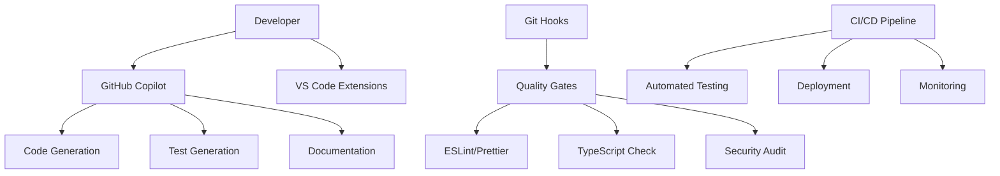

# AI Agents & Development Automation

This document outlines the AI agents, automated workflows, and development assistance tools used in the 3D Inventory project ecosystem.

## Table of Contents

1. [Overview](#overview)
2. [GitHub Copilot Integration](#github-copilot-integration)
3. [AI-Assisted Development Workflow](#ai-assisted-development-workflow)
4. [Automated Quality Gates](#automated-quality-gates)
5. [Testing Automation](#testing-automation)
6. [Test Verification & Quality Assurance](#test-verification--quality-assurance)
7. [Documentation Generation](#documentation-generation)
8. [Code Analysis & Optimization](#code-analysis--optimization)
9. [Deployment Automation](#deployment-automation)
10. [Monitoring & Alerting](#monitoring--alerting)
11. [Best Practices](#best-practices)

## Overview

The 3D Inventory project leverages advanced AI agents and automation tools to enhance development productivity, code quality, and system reliability across both the **API backend** (`3d-inventory-mongo-api`) and **Angular frontend** (`3d-inventory-angular-ui`).

### Architecture Components



## GitHub Copilot Integration

### Primary Use Cases

#### 🤖 **Code Generation & Completion**

- **API Endpoints**: Automated generation of REST API endpoints with proper TypeScript typing
- **Angular Components**: Complete component generation with templates, services, and routing
- **Database Models**: MongoDB schema definitions with validation and indexing
- **Service Layer**: Business logic implementation with error handling and logging

#### 🧪 **Test Automation**

- **Unit Tests**: Automated Jest test generation for services and components
- **Integration Tests**: API endpoint testing with proper mocking and assertions
- **E2E Tests**: Browser automation scripts for critical user workflows
- **Login Testing**: Comprehensive authentication flow testing (see `test-login-functionality.js`)

#### 📚 **Documentation Generation**

- **API Documentation**: OpenAPI/Swagger specifications with detailed examples
- **Component Documentation**: Angular component documentation with JSDoc
- **Workflow Guides**: Development process documentation and troubleshooting guides
- **Architecture Diagrams**: Mermaid diagrams for system architecture visualization

### Implementation Examples

#### Login Testing Agent

```javascript
// AI-generated comprehensive login testing
// File: test-login-functionality.js
const testCredentials = [
  { username: 'admin', password: 'admin123!', role: 'admin' },
  { username: 'user', password: 'user123!', role: 'user' },
  { username: 'carlo', password: 'carlo123!', role: 'user' },
  { username: 'viewer', password: 'viewer123!', role: 'viewer' },
]

async function testLoginUI(username, password) {
  // AI-generated automated UI testing logic
  // Includes form interaction, validation, and result verification
}
```

#### API Integration Verification

```typescript
// AI-assisted API integration testing
// File: src/app/tests/login-functionality.spec.ts
describe('Login Functionality Tests', () => {
  // Comprehensive test suite covering:
  // - Admin login scenarios
  // - User login scenarios
  // - Error handling
  // - Token management
  // - State persistence
})
```

## AI-Assisted Development Workflow

### Development Phases

#### 1. **Planning & Architecture**

- **AI Consultation**: Feature planning with architecture recommendations
- **Code Structure**: Automated project structure generation
- **Dependency Analysis**: Smart dependency selection and conflict resolution

#### 2. **Implementation**

- **Code Generation**: Real-time code completion and generation
- **Pattern Recognition**: Consistent coding patterns across the project
- **Refactoring Assistance**: Automated code optimization suggestions

#### 3. **Quality Assurance**

- **Automated Review**: Code quality analysis with improvement suggestions
- **Test Generation**: Comprehensive test coverage with edge cases
- **Security Analysis**: Vulnerability detection and mitigation

#### 4. **Documentation**

- **Inline Documentation**: JSDoc and TypeDoc generation
- **README Updates**: Automated documentation updates
- **Change Logs**: Automated release notes and change documentation

## Automated Quality Gates

### Pre-commit Automation

```bash
# Automated quality checks before each commit
# Defined in .husky/pre-commit
#!/bin/sh
npm run lint:fix        # ESLint auto-fix
npm run format         # Prettier formatting
npm run check:type     # TypeScript validation
npm run test:changed   # Tests for changed files
npm run security:audit # Security vulnerability check
```

### Pre-push Automation

```bash
# Comprehensive checks before pushing
#!/bin/sh
npm run test:full      # Complete test suite
npm run build         # Build verification
npm run lint:strict   # Strict linting rules
npm run coverage     # Test coverage validation
```

### Quality Metrics Tracking

- **Code Coverage**: Automated tracking with Jest (>80% threshold)
- **Type Safety**: 100% TypeScript strict mode compliance
- **Security Score**: Automated vulnerability scanning
- **Performance Metrics**: Bundle size and runtime performance monitoring

## Testing Automation

### Test Categories

#### **Unit Tests**

```typescript
// AI-generated service tests
describe('AuthenticationService', () => {
  it('should authenticate admin user', () => {
    // Comprehensive test scenarios generated by AI
  })

  it('should handle rate limiting', () => {
    // Edge case testing with proper mocking
  })
})
```

#### **Integration Tests**

```javascript
// API integration testing
describe('Connection API Integration', () => {
  it('should verify connection CRUD operations', async () => {
    // Full API workflow testing
  })
})
```

#### **Database Authentication Tests**

```typescript
// Direct database authentication testing
// File: test-db-auth.ts - Comprehensive user authentication verification
const TEST_CREDENTIALS = [
  { username: 'admin', password: 'admin123!' },
  { username: 'user', password: 'user123!' },
  { username: 'carlo', password: 'carlo123!' },
  { username: 'viewer', password: 'viewer123!' },
]

// Tests user existence, authentication, and role validation
```

#### **E2E Testing**

```javascript
// Browser automation testing
describe('Edit Connection Workflow', () => {
  it('should display logs and attributes dictionary', async () => {
    // Complete user workflow testing
  })
})
```

### Test Automation Pipeline

1. **Continuous Testing**: Tests run on every code change
2. **Parallel Execution**: Multiple test suites running simultaneously
3. **Smart Test Selection**: Only run tests affected by changes
4. **Automated Reporting**: Detailed test reports with coverage metrics

## Test Verification & Quality Assurance

### 🔍 **Automated Test Verification Commands**

#### **API Backend Testing** (`3d-inventory-api`)

```bash
# Core testing commands
npm test                    # Run full Jest test suite
npm run test:coverage      # Generate coverage reports (>80% threshold)
npm run test:watch         # Watch mode for development

# Authentication & Database Testing
npm run test:db-auth       # Direct database authentication tests
npm run test:auth          # API authentication endpoint tests

# Quality assurance
npm run check:quality      # Lint + TypeScript + Tests combined
npm run test:git-hooks     # Test git hooks functionality
```

#### **Angular Frontend Testing** (`3d-inventory-ui`)

```bash
# Angular-specific testing
npm test                   # Jest-based Angular component tests
npm run test:coverage      # Angular test coverage reports

# Build verification
npm run build              # Production build test
npm run lint:check         # Angular ESLint verification
```

### 🧪 **Test File Structure & Organization**

#### **API Test Files**

- **`test-db-auth.ts`**: Direct database authentication verification
- **`src/tests/`**: Core testing utilities and generators
- **`*.spec.ts`**: Jest unit tests for services and controllers
- **`jest.config.ts`**: Jest configuration with TypeScript support

#### **UI Test Files**

- **`src/app/**/\*.spec.ts`\*\*: Angular component and service tests
- **`src/app/testing/`**: Test utilities and mocks
- **`jest.config.ts`**: Angular Jest configuration

### 📊 **Test Validation Workflows**

#### **Pre-Development Verification**

```bash
# Verify test environment setup
cd /path/to/3d-inventory-api
npm run test:db-auth              # Validate database connectivity
npm run test:auth                 # Verify authentication flow

cd /path/to/3d-inventory-ui
npm test                          # Validate Angular test setup
```

#### **Development Testing Cycle**

1. **Write Tests First**: AI assists in generating comprehensive test suites
2. **Run Tests Continuously**: Watch mode during development
3. **Validate Coverage**: Ensure >80% test coverage threshold
4. **Integration Testing**: Full API + UI workflow validation

#### **Pre-Deployment Verification**

```bash
# API verification pipeline
npm run check:quality             # Complete quality gate
npm run test:coverage            # Coverage validation
npm run build                    # Build verification

# UI verification pipeline
npm run lint:check               # Angular linting
npm run build:prod              # Production build test
npm run test                    # Component test validation
```

### 🔗 **Test-Related File Links**

#### **Configuration Files**

- **[`jest.config.ts`](jest.config.ts)**: Jest testing framework configuration
- **[`package.json`](package.json)**: NPM scripts for testing workflows
- **[`.husky/`](.husky/)**: Git hooks for automated testing

#### **Testing Documentation**

- **[`JEST-TESTING.md`](JEST-TESTING.md)**: Comprehensive Jest testing guide
- **[`DEVELOPMENT.md`](DEVELOPMENT.md)**: Development workflow with testing integration
- **[`MODERN-JEST-SETUP.md`](MODERN-JEST-SETUP.md)**: Modern Jest configuration guide

#### **Test Utilities & Scripts**

- **[`test-db-auth.ts`](test-db-auth.ts)**: Database authentication testing script
- **[`src/utils/tests.ts`](src/utils/tests.ts)**: Testing utility functions
- **[`src/tests/testGenerators.ts`](src/tests/testGenerators.ts)**: Test data generators

### 🚀 **AI-Enhanced Test Verification**

#### **Automated Test Generation**

```typescript
// AI generates comprehensive test scenarios
describe('UserService Authentication', () => {
  // AI analyzes the service and generates:
  // - Happy path tests
  // - Edge cases
  // - Error scenarios
  // - Performance tests
  // - Security validations
})
```

#### **Smart Test Execution**

- **Affected Tests Only**: AI identifies which tests to run based on code changes
- **Parallel Execution**: Optimized test running for faster feedback
- **Failure Analysis**: AI provides root cause analysis for failing tests
- **Coverage Gaps**: Identifies untested code paths automatically

#### **Test Quality Metrics**

```bash
# AI-enhanced testing metrics
npm run test:coverage            # Code coverage analysis
npm run test:performance         # Performance regression testing
npm run test:security           # Security vulnerability testing
npm run test:integration        # Full system integration validation
```

### 🎯 **Best Practices for Test Verification**

#### **Daily Development Routine**

1. **Morning Setup**: Run `npm run test:db-auth` to verify environment
2. **Development**: Use `npm run test:watch` for continuous feedback
3. **Pre-Commit**: Automated testing via git hooks
4. **Pre-Push**: Full test suite validation

#### **Quality Gates**

- **Minimum Coverage**: 80% code coverage required
- **Test Performance**: Tests must complete within 2 minutes
- **Integration Tests**: Must validate complete user workflows
- **Security Tests**: Authentication and authorization validation

#### **Troubleshooting Common Issues**

```bash
# Database connection issues
npm run test:db-auth             # Diagnose authentication problems
npm run check:mongo             # Verify MongoDB Atlas connection

# Test environment issues
npm run test -- --verbose       # Detailed test output
npm run test:coverage -- --watch # Coverage in watch mode

# Build and deployment testing
npm run build                   # Verify production build
npm run docker:test            # Test Docker containerization
```

## Documentation Generation

### Automated Documentation Types

#### **API Documentation**

- **OpenAPI Specification**: Auto-generated from TypeScript interfaces
- **Postman Collections**: Automated API testing collections
- **SDK Generation**: Client libraries for different languages

#### **Code Documentation**

- **TypeDoc**: Comprehensive TypeScript documentation
- **JSDoc**: JavaScript documentation with examples
- **Component Guides**: Angular component usage documentation

#### **Process Documentation**

- **Development Guides**: Step-by-step development processes
- **Deployment Guides**: Automated deployment documentation
- **Troubleshooting**: Common issues and automated solutions

### Documentation Workflow

```bash
# Automated documentation generation
npm run docs:generate   # Generate all documentation
npm run docs:api       # API documentation only
npm run docs:deploy    # Deploy to documentation site
```

## Code Analysis & Optimization

### Static Analysis Tools

#### **ESLint Configuration**

```typescript
// Advanced ESLint configuration with AI-recommended rules
export default [
  {
    rules: {
      '@typescript-eslint/no-unused-vars': 'error',
      '@typescript-eslint/explicit-return-types': 'warn',
      'prefer-const': 'error',
      'no-var': 'error',
    },
  },
]
```

#### **Quality Metrics**

- **Cyclomatic Complexity**: Automated complexity analysis
- **Code Duplication**: Detection and refactoring suggestions
- **Performance Analysis**: Bundle size and runtime optimization
- **Security Analysis**: Vulnerability detection and remediation

### Optimization Automation

```bash
# Automated code optimization pipeline
npm run optimize:bundle    # Bundle size optimization
npm run optimize:images    # Image compression
npm run optimize:deps      # Dependency optimization
npm run analyze:complexity # Code complexity analysis
```

## Deployment Automation

### CI/CD Pipeline

#### **GitHub Actions Workflow**

```yaml
# .github/workflows/deploy.yml
name: AI-Assisted Deployment
on:
  push:
    branches: [main]
jobs:
  quality-gate:
    runs-on: ubuntu-latest
    steps:
      - name: AI Code Review
        uses: github/copilot-cli@v1
      - name: Automated Testing
        run: npm run test:ci
      - name: Security Scan
        run: npm run security:scan
```

#### **Deployment Targets**

- **Development**: Automated deployment on feature branches
- **Staging**: Integration testing environment
- **Production**: Blue-green deployment with health checks

### Infrastructure as Code

```yaml
# Google Cloud deployment with automation
apiVersion: v1
kind: Service
metadata:
  name: 3d-inventory-api
  annotations:
    # AI-optimized resource allocation
    autoscaling.knative.dev/minScale: '1'
    autoscaling.knative.dev/maxScale: '10'
```

## Monitoring & Alerting

### Automated Monitoring

#### **Application Metrics**

- **Performance Monitoring**: Response times and throughput
- **Error Tracking**: Automated error detection and alerting
- **User Analytics**: Usage patterns and behavior analysis
- **Resource Utilization**: CPU, memory, and network monitoring

#### **Log Analysis**

```typescript
// AI-enhanced logging service
export class LogService {
  createLog(entry: LogEntry): Observable<Log> {
    // Automated log categorization and analysis
    return this.http.post<Log>('/logs', {
      ...entry,
      timestamp: new Date().toISOString(),
      context: this.generateContext(),
      severity: this.analyzeSeverity(entry),
    })
  }
}
```

### Alert Automation

- **Smart Alerting**: AI-driven alert prioritization
- **Escalation Policies**: Automated incident escalation
- **Auto-remediation**: Self-healing system responses
- **Predictive Alerts**: Proactive issue detection

## Best Practices

### AI Agent Integration

#### **Code Generation Guidelines**

1. **Review Generated Code**: Always review AI-generated code for correctness
2. **Test Coverage**: Ensure AI-generated code includes comprehensive tests
3. **Documentation**: Verify that generated code is properly documented
4. **Security Review**: Security audit all AI-generated authentication and authorization code

#### **Quality Standards**

```typescript
// AI-assisted code should meet these standards:
interface CodeQualityStandards {
  typeScript: 'strict' // 100% TypeScript strict mode
  testCoverage: '>80%' // Minimum test coverage
  documentation: 'comprehensive' // Full JSDoc coverage
  security: 'audited' // Security review required
  performance: 'optimized' // Performance benchmarked
}
```

### Development Workflow Integration

#### **Daily Development**

1. **Morning Setup**: AI-assisted priority planning
2. **Code Development**: Real-time AI assistance and completion
3. **Quality Checks**: Automated pre-commit validation
4. **Evening Review**: AI-generated progress reports

#### **Sprint Planning**

- **Story Analysis**: AI-assisted story point estimation
- **Technical Debt**: Automated technical debt identification
- **Risk Assessment**: AI-driven risk analysis and mitigation

### Continuous Improvement

#### **Learning Loop**

1. **Pattern Recognition**: AI learns from codebase patterns
2. **Feedback Integration**: Developer feedback improves AI suggestions
3. **Metric Analysis**: Performance metrics guide optimization
4. **Knowledge Sharing**: Automated best practice documentation

## Configuration Files

### Key Configuration Files

- **`.husky/`**: Git hooks for quality automation
- **`eslint.config.ts`**: ESLint configuration with AI recommendations
- **`jest.config.ts`**: Testing framework configuration
- **`.github/workflows/`**: CI/CD pipeline definitions
- **`tsconfig.json`**: TypeScript configuration with strict rules

### Environment-Specific Configurations

```bash
# Development environment
NODE_ENV=development
AI_ASSISTANCE=enabled
AUTOMATED_TESTING=true

# Production environment
NODE_ENV=production
AI_MONITORING=enabled
AUTOMATED_DEPLOYMENT=true
```

## Future Enhancements

### Planned AI Integrations

1. **Predictive Bug Detection**: AI-powered bug prediction and prevention
2. **Automated Performance Optimization**: Self-optimizing application performance
3. **Intelligent Error Recovery**: Advanced error handling and recovery mechanisms
4. **Smart Resource Scaling**: AI-driven infrastructure scaling decisions

### Roadmap

- **Q1 2025**: Enhanced AI code review integration
- **Q2 2025**: Predictive analytics for system health
- **Q3 2025**: Automated performance optimization
- **Q4 2025**: Full AI-driven DevOps pipeline

## Resources

### 📚 **Core Documentation Links**

#### **Development & Testing**

- **[Development Workflow Guide](DEVELOPMENT.md)**: Complete development setup and processes
- **[Jest Testing Guidelines](JEST-TESTING.md)**: Comprehensive testing framework documentation
- **[Modern Jest Setup](MODERN-JEST-SETUP.md)**: Latest Jest configuration and best practices
- **[Security Policies](SECURITY.md)**: Security guidelines and authentication protocols
- **[API Documentation](README.md)**: Complete API reference and usage examples

#### **Project Configuration**

- **[Package Configuration](package.json)**: NPM scripts and dependencies
- **[Jest Configuration](jest.config.ts)**: Testing framework setup
- **[TypeScript Configuration](tsconfig.json)**: TypeScript compiler settings
- **[ESLint Configuration](eslint.config.ts)**: Code quality and style rules

#### **Testing & Quality Assurance**

- **[Database Auth Test](test-db-auth.ts)**: Direct database authentication testing
- **[Test Utilities](src/utils/tests.ts)**: Testing helper functions and utilities
- **[Test Generators](src/tests/testGenerators.ts)**: AI-assisted test data generation
- **[Quality Report](quality-report.json)**: Automated code quality metrics

#### **Deployment & Operations**

- **[Docker Configuration](Dockerfile)**: Container deployment setup
- **[Google Cloud Setup](README-GCP.md)**: Cloud deployment documentation
- **[Build Scripts](build.sh)**: Automated build and deployment processes

### 🛠️ **Tools and Services**

#### **AI Development Tools**

- **GitHub Copilot**: AI-powered code completion and generation
- **VS Code Extensions**: Development environment enhancement
  - GitHub Copilot
  - TypeScript and JavaScript Language Support
  - Jest Runner
  - Angular Language Service

#### **Testing Framework**

- **Jest**: Primary testing framework with AI integration
- **Supertest**: HTTP assertion library for API testing
- **Test Data Bot**: AI-assisted test data generation
- **MongoDB Memory Server**: In-memory database for testing

#### **Code Quality & Analysis**

- **ESLint/Prettier**: Code quality and formatting
- **TypeScript**: Static type checking and code analysis
- **SonarQube**: Code quality and security analysis
- **Depcheck**: Dependency usage analysis

#### **Deployment & Infrastructure**

- **Google Cloud Platform**: Production deployment and hosting
- **Docker**: Containerization and deployment
- **MongoDB Atlas**: Cloud database service
- **GitHub Actions**: CI/CD pipeline automation

### 🎓 **Support and Training Resources**

#### **AI Development Best Practices**

- **Internal Guidelines**: AI tool usage standards and recommendations
- **Code Review Standards**: AI-assisted code review protocols
- **Testing Standards**: AI-generated test quality requirements
- **Security Guidelines**: AI security analysis and validation

#### **Training Materials**

- **GitHub Copilot Training**: Effective AI assistance integration
- **Jest Testing Workshops**: Comprehensive testing methodology
- **TypeScript Best Practices**: Type-safe development patterns
- **API Design Patterns**: RESTful API development with AI assistance

#### **Community & Collaboration**

- **Development Standards**: Team collaboration with AI tools
- **Documentation Standards**: AI-enhanced documentation practices
- **Code Sharing Guidelines**: AI-generated code sharing protocols
- **Troubleshooting Resources**: Common issues and AI-assisted solutions

### 🔗 **Related Projects & Integration**

#### **Cross-Project Integration**

- **[AI Testing Integration Summary](docs/troubleshooting/archive/AI-TESTING-INTEGRATION.md)**: Comprehensive testing strategy across both projects
- **[3D Inventory UI](../3d-inventory-ui/)**: Angular frontend application
- **[UI Agents Guide](../3d-inventory-ui/AGENTS.md)**: Frontend AI automation
- **[UI Testing](../3d-inventory-ui/src/app/testing/)**: Frontend testing utilities

#### **External Services & APIs**

- **MongoDB Atlas**: Database service integration
- **Google Cloud APIs**: Cloud service integrations
- **Authentication Services**: JWT and OAuth integration
- **Monitoring Services**: Application performance monitoring

### 🆘 **Quick Reference & Troubleshooting**

#### **Common Commands**

```bash
# Testing
npm run test:db-auth        # Database authentication verification
npm run test:coverage       # Generate test coverage reports
npm run test:watch          # Development testing mode

# Quality Assurance
npm run check:quality       # Complete quality verification
npm run lint:fix           # Automated code formatting
npm run security:audit     # Security vulnerability scan

# Development
npm run dev                # Development server with hot reload
npm run build              # Production build verification
npm run docker:build       # Container build testing
```

#### **Troubleshooting Links**

- **[Authentication Issues](test-db-auth.ts)**: Database connection problems
- **[Build Problems](DEVELOPMENT.md)**: Common build issues
- **[Testing Failures](JEST-TESTING.md)**: Test debugging guide
- **[Deployment Issues](README-GCP.md)**: Cloud deployment problems

---

_This document is maintained by the AI-assisted development workflow and is automatically updated as new agents and automation tools are integrated into the project._
