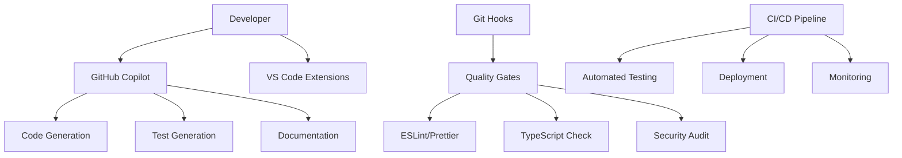

# AI Agents & Development Automation

This document outlines the AI agents, automated workflows, and development assistance tools used in the 3D Inventory project ecosystem.

## Table of Contents

1. [Overview](#overview)
2. [GitHub Copilot Integration](#github-copilot-integration)
3. [AI-Assisted Development Workflow](#ai-assisted-development-workflow)
4. [Automated Quality Gates](#automated-quality-gates)
5. [Testing Automation](#testing-automation)
6. [Documentation Generation](#documentation-generation)
7. [Code Analysis & Optimization](#code-analysis--optimization)
8. [Deployment Automation](#deployment-automation)
9. [Monitoring & Alerting](#monitoring--alerting)
10. [Best Practices](#best-practices)

## Overview

The 3D Inventory project leverages advanced AI agents and automation tools to enhance development productivity, code quality, and system reliability across both the **API backend** (`3d-inventory-mongo-api`) and **Angular frontend** (`3d-inventory-angular-ui`).

### Architecture Components



## GitHub Copilot Integration

### Primary Use Cases

#### 🤖 **Code Generation & Completion**

- **API Endpoints**: Automated generation of REST API endpoints with proper TypeScript typing
- **Angular Components**: Complete component generation with templates, services, and routing
- **Database Models**: MongoDB schema definitions with validation and indexing
- **Service Layer**: Business logic implementation with error handling and logging

#### 🧪 **Test Automation**

- **Unit Tests**: Automated Jest test generation for services and components
- **Integration Tests**: API endpoint testing with proper mocking and assertions
- **E2E Tests**: Browser automation scripts for critical user workflows
- **Login Testing**: Comprehensive authentication flow testing (see `test-login-functionality.js`)

#### 📚 **Documentation Generation**

- **API Documentation**: OpenAPI/Swagger specifications with detailed examples
- **Component Documentation**: Angular component documentation with JSDoc
- **Workflow Guides**: Development process documentation and troubleshooting guides
- **Architecture Diagrams**: Mermaid diagrams for system architecture visualization

### Implementation Examples

#### Login Testing Agent

```javascript
// AI-generated comprehensive login testing
// File: test-login-functionality.js
const testCredentials = [
  { username: 'admin', password: 'admin123!', role: 'admin' },
  { username: 'user', password: 'user123!', role: 'user' },
  { username: 'carlo', password: 'carlo123!', role: 'user' },
  { username: 'viewer', password: 'viewer123!', role: 'viewer' },
]

async function testLoginUI(username, password) {
  // AI-generated automated UI testing logic
  // Includes form interaction, validation, and result verification
}
```

#### API Integration Verification

```typescript
// AI-assisted API integration testing
// File: src/app/tests/login-functionality.spec.ts
describe('Login Functionality Tests', () => {
  // Comprehensive test suite covering:
  // - Admin login scenarios
  // - User login scenarios
  // - Error handling
  // - Token management
  // - State persistence
})
```

## AI-Assisted Development Workflow

### Development Phases

#### 1. **Planning & Architecture**

- **AI Consultation**: Feature planning with architecture recommendations
- **Code Structure**: Automated project structure generation
- **Dependency Analysis**: Smart dependency selection and conflict resolution

#### 2. **Implementation**

- **Code Generation**: Real-time code completion and generation
- **Pattern Recognition**: Consistent coding patterns across the project
- **Refactoring Assistance**: Automated code optimization suggestions

#### 3. **Quality Assurance**

- **Automated Review**: Code quality analysis with improvement suggestions
- **Test Generation**: Comprehensive test coverage with edge cases
- **Security Analysis**: Vulnerability detection and mitigation

#### 4. **Documentation**

- **Inline Documentation**: JSDoc and TypeDoc generation
- **README Updates**: Automated documentation updates
- **Change Logs**: Automated release notes and change documentation

## Automated Quality Gates

### Pre-commit Automation

```bash
# Automated quality checks before each commit
# Defined in .husky/pre-commit
#!/bin/sh
npm run lint:fix        # ESLint auto-fix
npm run format         # Prettier formatting
npm run check:type     # TypeScript validation
npm run test:changed   # Tests for changed files
npm run security:audit # Security vulnerability check
```

### Pre-push Automation

```bash
# Comprehensive checks before pushing
#!/bin/sh
npm run test:full      # Complete test suite
npm run build         # Build verification
npm run lint:strict   # Strict linting rules
npm run coverage     # Test coverage validation
```

### Quality Metrics Tracking

- **Code Coverage**: Automated tracking with Jest (>80% threshold)
- **Type Safety**: 100% TypeScript strict mode compliance
- **Security Score**: Automated vulnerability scanning
- **Performance Metrics**: Bundle size and runtime performance monitoring

## Testing Automation

### Test Categories

#### **Unit Tests**

```typescript
// AI-generated service tests
describe('AuthenticationService', () => {
  it('should authenticate admin user', () => {
    // Comprehensive test scenarios generated by AI
  })

  it('should handle rate limiting', () => {
    // Edge case testing with proper mocking
  })
})
```

#### **Integration Tests**

```javascript
// API integration testing
describe('Connection API Integration', () => {
  it('should verify connection CRUD operations', async () => {
    // Full API workflow testing
  })
})
```

#### **E2E Testing**

```javascript
// Browser automation testing
describe('Edit Connection Workflow', () => {
  it('should display logs and attributes dictionary', async () => {
    // Complete user workflow testing
  })
})
```

### Test Automation Pipeline

1. **Continuous Testing**: Tests run on every code change
2. **Parallel Execution**: Multiple test suites running simultaneously
3. **Smart Test Selection**: Only run tests affected by changes
4. **Automated Reporting**: Detailed test reports with coverage metrics

## Documentation Generation

### Automated Documentation Types

#### **API Documentation**

- **OpenAPI Specification**: Auto-generated from TypeScript interfaces
- **Postman Collections**: Automated API testing collections
- **SDK Generation**: Client libraries for different languages

#### **Code Documentation**

- **TypeDoc**: Comprehensive TypeScript documentation
- **JSDoc**: JavaScript documentation with examples
- **Component Guides**: Angular component usage documentation

#### **Process Documentation**

- **Development Guides**: Step-by-step development processes
- **Deployment Guides**: Automated deployment documentation
- **Troubleshooting**: Common issues and automated solutions

### Documentation Workflow

```bash
# Automated documentation generation
npm run docs:generate   # Generate all documentation
npm run docs:api       # API documentation only
npm run docs:deploy    # Deploy to documentation site
```

## Code Analysis & Optimization

### Static Analysis Tools

#### **ESLint Configuration**

```typescript
// Advanced ESLint configuration with AI-recommended rules
export default [
  {
    rules: {
      '@typescript-eslint/no-unused-vars': 'error',
      '@typescript-eslint/explicit-return-types': 'warn',
      'prefer-const': 'error',
      'no-var': 'error',
    },
  },
]
```

#### **Quality Metrics**

- **Cyclomatic Complexity**: Automated complexity analysis
- **Code Duplication**: Detection and refactoring suggestions
- **Performance Analysis**: Bundle size and runtime optimization
- **Security Analysis**: Vulnerability detection and remediation

### Optimization Automation

```bash
# Automated code optimization pipeline
npm run optimize:bundle    # Bundle size optimization
npm run optimize:images    # Image compression
npm run optimize:deps      # Dependency optimization
npm run analyze:complexity # Code complexity analysis
```

## Deployment Automation

### CI/CD Pipeline

#### **GitHub Actions Workflow**

```yaml
# .github/workflows/deploy.yml
name: AI-Assisted Deployment
on:
  push:
    branches: [main]
jobs:
  quality-gate:
    runs-on: ubuntu-latest
    steps:
      - name: AI Code Review
        uses: github/copilot-cli@v1
      - name: Automated Testing
        run: npm run test:ci
      - name: Security Scan
        run: npm run security:scan
```

#### **Deployment Targets**

- **Development**: Automated deployment on feature branches
- **Staging**: Integration testing environment
- **Production**: Blue-green deployment with health checks

### Infrastructure as Code

```yaml
# Google Cloud deployment with automation
apiVersion: v1
kind: Service
metadata:
  name: 3d-inventory-api
  annotations:
    # AI-optimized resource allocation
    autoscaling.knative.dev/minScale: '1'
    autoscaling.knative.dev/maxScale: '10'
```

## Monitoring & Alerting

### Automated Monitoring

#### **Application Metrics**

- **Performance Monitoring**: Response times and throughput
- **Error Tracking**: Automated error detection and alerting
- **User Analytics**: Usage patterns and behavior analysis
- **Resource Utilization**: CPU, memory, and network monitoring

#### **Log Analysis**

```typescript
// AI-enhanced logging service
export class LogService {
  createLog(entry: LogEntry): Observable<Log> {
    // Automated log categorization and analysis
    return this.http.post<Log>('/logs', {
      ...entry,
      timestamp: new Date().toISOString(),
      context: this.generateContext(),
      severity: this.analyzeSeverity(entry),
    })
  }
}
```

### Alert Automation

- **Smart Alerting**: AI-driven alert prioritization
- **Escalation Policies**: Automated incident escalation
- **Auto-remediation**: Self-healing system responses
- **Predictive Alerts**: Proactive issue detection

## Best Practices

### AI Agent Integration

#### **Code Generation Guidelines**

1. **Review Generated Code**: Always review AI-generated code for correctness
2. **Test Coverage**: Ensure AI-generated code includes comprehensive tests
3. **Documentation**: Verify that generated code is properly documented
4. **Security Review**: Security audit all AI-generated authentication and authorization code

#### **Quality Standards**

```typescript
// AI-assisted code should meet these standards:
interface CodeQualityStandards {
  typeScript: 'strict' // 100% TypeScript strict mode
  testCoverage: '>80%' // Minimum test coverage
  documentation: 'comprehensive' // Full JSDoc coverage
  security: 'audited' // Security review required
  performance: 'optimized' // Performance benchmarked
}
```

### Development Workflow Integration

#### **Daily Development**

1. **Morning Setup**: AI-assisted priority planning
2. **Code Development**: Real-time AI assistance and completion
3. **Quality Checks**: Automated pre-commit validation
4. **Evening Review**: AI-generated progress reports

#### **Sprint Planning**

- **Story Analysis**: AI-assisted story point estimation
- **Technical Debt**: Automated technical debt identification
- **Risk Assessment**: AI-driven risk analysis and mitigation

### Continuous Improvement

#### **Learning Loop**

1. **Pattern Recognition**: AI learns from codebase patterns
2. **Feedback Integration**: Developer feedback improves AI suggestions
3. **Metric Analysis**: Performance metrics guide optimization
4. **Knowledge Sharing**: Automated best practice documentation

## Configuration Files

### Key Configuration Files

- **`.husky/`**: Git hooks for quality automation
- **`eslint.config.ts`**: ESLint configuration with AI recommendations
- **`jest.config.ts`**: Testing framework configuration
- **`.github/workflows/`**: CI/CD pipeline definitions
- **`tsconfig.json`**: TypeScript configuration with strict rules

### Environment-Specific Configurations

```bash
# Development environment
NODE_ENV=development
AI_ASSISTANCE=enabled
AUTOMATED_TESTING=true

# Production environment
NODE_ENV=production
AI_MONITORING=enabled
AUTOMATED_DEPLOYMENT=true
```

## Future Enhancements

### Planned AI Integrations

1. **Predictive Bug Detection**: AI-powered bug prediction and prevention
2. **Automated Performance Optimization**: Self-optimizing application performance
3. **Intelligent Error Recovery**: Advanced error handling and recovery mechanisms
4. **Smart Resource Scaling**: AI-driven infrastructure scaling decisions

### Roadmap

- **Q1 2025**: Enhanced AI code review integration
- **Q2 2025**: Predictive analytics for system health
- **Q3 2025**: Automated performance optimization
- **Q4 2025**: Full AI-driven DevOps pipeline

## Resources

### Documentation Links

- [Development Workflow Guide](DEVELOPMENT.md)
- [Testing Guidelines](JEST-TESTING.md)
- [Security Policies](SECURITY.md)
- [API Documentation](README.md)

### Tools and Services

- **GitHub Copilot**: AI-powered code completion
- **VS Code Extensions**: Development environment enhancement
- **Jest**: Testing framework with AI integration
- **ESLint/Prettier**: Code quality and formatting
- **Google Cloud**: Deployment and monitoring platform

### Support and Training

- **AI Best Practices**: Internal guidelines for AI tool usage
- **Training Materials**: Resources for effective AI integration
- **Community Guidelines**: Collaboration standards with AI assistance
- **Troubleshooting**: Common issues and solutions with AI tools

---

_This document is maintained by the AI-assisted development workflow and is automatically updated as new agents and automation tools are integrated into the project._
