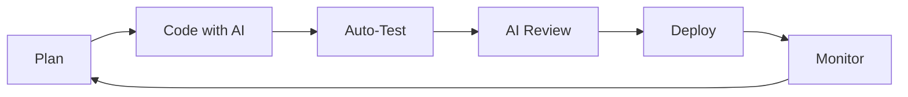

# 🤖 AI Agents & Testing Integration Summary

This document provides a comprehensive overview of AI-assisted development and testing workflows across the **3D Inventory** project ecosystem.

## 🔗 **Related Documentation**

### **Core AI Agents Documentation**

- **[API Backend Agents](../3d-inventory-api/AGENTS.md)**: Node.js/Express AI automation
- **[Angular UI Agents](../3d-inventory-ui/AGENTS.md)**: Angular frontend AI automation

### **Testing & Quality Documentation**

- **[API Testing Guide](../3d-inventory-api/JEST-TESTING.md)**: Backend testing framework
- **[API Development Guide](../3d-inventory-api/DEVELOPMENT.md)**: Complete development workflow
- **[UI Testing Setup](../3d-inventory-ui/jest.config.ts)**: Angular testing configuration

## 🧪 **Comprehensive Testing Strategy**

### **Backend Testing** (`3d-inventory-api`)

```bash
# Authentication Testing
npm run test:db-auth              # Direct database authentication tests
npm run test:auth                 # API endpoint authentication tests

# Core Testing Suite
npm test                          # Jest unit tests
npm run test:coverage            # Coverage reports (>80% threshold)
npm run test:watch               # Development watch mode

# Quality Assurance
npm run check:quality            # Lint + TypeScript + Tests
npm run build                    # Production build verification
```

### **Frontend Testing** (`3d-inventory-ui`)

```bash
# Angular Testing
npm test                         # Jest-based component tests
npm run test:coverage           # Angular test coverage

# Build & Quality
npm run build:prod              # Production build
npm run lint:check              # Angular ESLint verification
```

## 🎯 **Key Testing Files & Their Purposes**

### **API Backend Test Files**

| File                          | Purpose                                | Command                |
| ----------------------------- | -------------------------------------- | ---------------------- |
| `test-db-auth.ts`             | Direct database authentication testing | `npm run test:db-auth` |
| `src/tests/testGenerators.ts` | AI-assisted test data generation       | Used by Jest tests     |
| `src/utils/tests.ts`          | Testing utility functions              | Used by all tests      |
| `jest.config.ts`              | Jest framework configuration           | Core test setup        |

### **Angular UI Test Files**

| File             | Purpose                    | Location               |
| ---------------- | -------------------------- | ---------------------- |
| `*.spec.ts`      | Component & service tests  | `src/app/**/*.spec.ts` |
| `test-setup.ts`  | Angular test configuration | `src/test-setup.ts`    |
| `jest.config.ts` | Jest framework setup       | Root directory         |
| `test-utils.ts`  | Testing utilities          | `src/app/testing/`     |

## 🚀 **AI-Enhanced Development Workflow**

### **1. Development Cycle**



### **2. Quality Gates**

- **Pre-Commit**: ESLint + Prettier + TypeScript + Tests
- **Pre-Push**: Full test suite + coverage validation
- **CI/CD**: Build verification + security audit + deployment

### **3. AI Assistance Points**

- **Code Generation**: GitHub Copilot for components, services, tests
- **Test Generation**: AI-assisted test scenarios and edge cases
- **Documentation**: Automated API docs and component documentation
- **Error Analysis**: AI-powered debugging and issue resolution

## 📊 **Quality Metrics & Monitoring**

### **Code Quality Standards**

- **Test Coverage**: >80% across both projects
- **TypeScript**: Strict mode enabled
- **Linting**: Zero ESLint errors/warnings
- **Security**: Regular vulnerability audits

### **Performance Monitoring**

- **API**: Response times, error rates, database performance
- **UI**: Bundle size, Core Web Vitals, user experience metrics
- **CI/CD**: Build times, test execution performance

## 🔧 **Development Environment Setup**

### **Required Extensions**

- GitHub Copilot
- TypeScript and JavaScript Language Support
- Jest Runner
- Angular Language Service (for UI)
- ESLint
- Prettier

### **Environment Variables**

```bash
# Backend (.env)
NODE_ENV=development
MONGODB_URI=mongodb://localhost:27017
JWT_SECRET=development-secret

# Frontend (environment.ts)
production: false
baseurl: 'http://localhost:8080'
```

## 🎓 **Training & Best Practices**

### **AI Tool Usage Guidelines**

1. **Review AI-generated code** for correctness and security
2. **Test AI-generated components** thoroughly
3. **Document AI-assisted decisions** for team knowledge
4. **Maintain coding standards** regardless of AI assistance

### **Testing Best Practices**

1. **Write tests first** when possible (TDD approach)
2. **Use AI for edge case generation** but validate thoroughly
3. **Maintain test data consistency** across environments
4. **Monitor test performance** and optimize slow tests

## 🆘 **Troubleshooting Quick Reference**

### **Common Issues & Solutions**

| Issue                | Solution                   | Command                     |
| -------------------- | -------------------------- | --------------------------- |
| Authentication fails | Check DB users & passwords | `npm run test:db-auth`      |
| Tests failing        | Verify environment setup   | `npm run test -- --verbose` |
| Build errors         | Check TypeScript config    | `npm run check:type`        |
| Linting issues       | Auto-fix formatting        | `npm run lint:fix`          |

### **Environment Validation**

```bash
# Verify complete development setup
cd /path/to/3d-inventory-api
npm run check:quality              # Backend validation

cd /path/to/3d-inventory-ui
npm run lint:check && npm test     # Frontend validation
```

## 🔮 **Future Enhancements**

### **Planned AI Integrations**

- **Predictive Testing**: AI identifies potential failure points
- **Automated Performance Optimization**: Self-tuning applications
- **Intelligent Error Recovery**: Auto-healing system responses
- **Advanced Code Review**: AI-powered security and quality analysis

### **Roadmap Timeline**

- **Q1 2025**: Enhanced AI code review and testing
- **Q2 2025**: Predictive analytics and monitoring
- **Q3 2025**: Automated performance optimization
- **Q4 2025**: Full AI-driven development pipeline

---

**Status**: ✅ **Active Development** - AI agents and testing infrastructure fully operational across both projects.

**Last Updated**: October 2025
**Next Review**: Q1 2025
