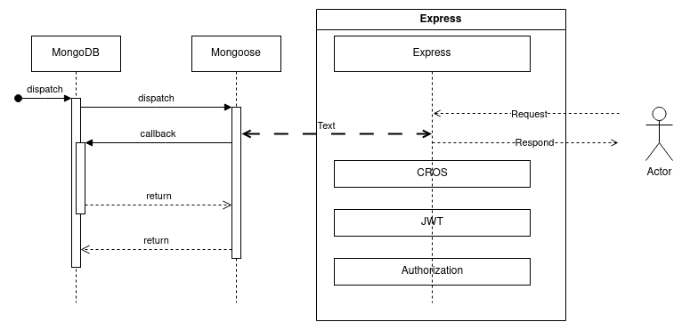

# 3d-inventory-mongo-api

1. [3d-inventory-mongo-api](#3d-inventory-mongo-api)
   1. [Purposse](#purposse)
      1. [Architecture](#architecture)
   2. [Stack](#stack)
      1. [Nodejs](#nodejs)
      2. [Project API by Swagger 3+](#project-api-by-swagger-3)
      3. [MongoDB](#mongodb)
         1. [Example of using a Mongoose cursor async with promises](#example-of-using-a-mongoose-cursor-async-with-promises)
   3. [Install node stack](#install-node-stack)
      1. [Use typescript](#use-typescript)
   4. [Playgrounds](#playgrounds)

[](https://wakatime.com/badge/user/3bbeedbe-0c6a-4a01-b3cd-a85d319a03bf/project/018c29b5-69aa-44a9-823a-51170ee4eafb)
[](https://GitHub.com/karol-preiskorn/3d-inventory-mongo-api/releases/)
[](https://GitHub.com/karol-preiskorn/3d-inventory-mongo-api/commit/)
[](https://GitHub.com/karol-preiskorn/3d-inventory-mongo-api/releases/)
[](https://GitHub.com/karol-preiskorn/3d-inventory-mongo-api/stargazers/)
[](https://GitHub.com/karol-preiskorn/3d-inventory-mongo-api/issues/)
[](https://lbesson.mit-license.org/)
[](https://www.typescriptlang.org/)
[](https://https://npmjs.com/)
[](http://ansicolortags.readthedocs.io/?badge=latest)
[](https://github.com/karol-preiskorn/3d-inventory-mongo-api/blob/master/LICENSE)

## Purposse

Create API for 3d-inventory application.

### Architecture



## Stack


### Nodejs

```bash

```

### Project API by Swagger 3+

```bash
podman pull docker://swaggerapi/swagger-editor
sudo podman run -d -p 80:8080 docker://swaggerapi/swagger-editor
```

### MongoDB

We can use MongoDB or programming Mongo Atlas API.

<https://www.mongodb.com/developer/languages/typescript/>

```bash
export MONGODB_VERSION=6.0-ubi8
podman pull mongodb/mongodb-community-server
docker run --name mongodb -d mongodb/mongodb-community-server:$MONGODB_VERSION
podman run -d -it -p 27017:27017
docker run --name mongodb -d -p 27017:27017 -v $(pwd)/data:/data/db mongodb/mongodb-community-server:$MONGODB_VERSION
```

#### Example of using a Mongoose cursor async with promises

```javascript
new Promise(function (resolve, reject) {
  collection.find(query).cursor()
    .on('data', function(doc) {
      // ...
    })
    .on('error', reject)
    .on('end', resolve);
})
.then(function () {
  // ...
});
```

It is generic code that can be tucked away in a utility function so it doesn't
clutter application code and obstruct actual application logic.

In your example simplest utility function would be like

```js
function streamToPromise(stream) {
    return new Promise(function(resolve, reject) {
        stream.on("end", resolve);
        stream.on("error", reject);
    });
}
```

And then the application code is simply

```js
Promise.map(files, function(file) {
    var stream = API.getStream(file);
    stream.pipe(endPoint);
    return streamToPromise(stream);
});
```

Reference:

- [Streams and promises](https://github.com/petkaantonov/bluebird/issues/332#issuecomment-58326173)
- [promise-streams](https://github.com/spion/promise-streams)

## Install node stack

```bash
npm install
```

### Use typescript

<https://github.com/Microsoft/TypeScript-Node-Starter#typescript--node>

## Playgrounds

```javascript
use('3d-inventory');

// Create a new document in the collection.
db.getCollection('models').insertOne({
  name: 'Model 10',
  dimension: {
    width: '1',
    height: '2',
    depth: '2'
  },
  texture: {
    front: '/assets/r710-2.5-nobezel__29341.png',
    back: '/assets/r710-2.5-nobezel__29341.png',
    side: '/assets/r710-2.5-nobezel__29341.png',
    top: '/assets/r710-2.5-nobezel__29341.png',
    botom: '/assets/r710-2.5-nobezel__29341.png'
  },
  type: 'CoolAir',
  category: 'Facility'
});
```
