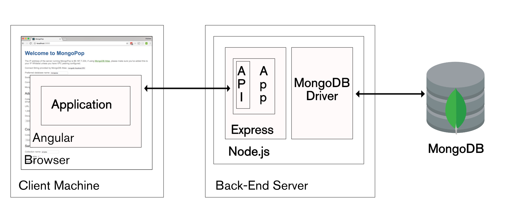

# 3d-inventory-mongo-api

1. [3d-inventory-mongo-api](#3d-inventory-mongo-api)
   1. [Purposes](#purposes)
      1. [Architecture](#architecture)
      2. [Use Swagger documentation](#use-swagger-documentation)
         1. [Example JSDoc](#example-jsdoc)
   2. [Stack](#stack)
      1. [Use MongoDB](#use-mongodb)
         1. [Example of using a cursor async with promises](#example-of-using-a-cursor-async-with-promises)
   3. [Install node stack](#install-node-stack)

[](https://wakatime.com/badge/user/3bbeedbe-0c6a-4a01-b3cd-a85d319a03bf/project/018c29b5-69aa-44a9-823a-51170ee4eafb)
[](https://GitHub.com/karol-preiskorn/3d-inventory-mongo-api/commit/)
[](https://GitHub.com/karol-preiskorn/3d-inventory-mongo-api/issues/)
[](https://www.javascript.com)
[](https://npmjs.com/package/express)
[](https://github.com/karol-preiskorn/3d-inventory-mongo-api/blob/master/LICENSE)
[](https://GitHub.com/karol-preiskorn/3d-inventory-mongo-api/stargazers/)

## Purposes

Create REST mongo API for [3d-inventory](https://github.com/users/karol-preiskorn/projects/2) application in Angular.

### Architecture


### Use Swagger documentation

[Swagger](https://app.swaggerhub.com/apis/karol-preiskorn/3d-inventory-rest-api/0.0.6#/) API definition generated by [swagger-jsdoc](https://www.npmjs.com/package/swagger-jsdoc) aj jsdoc documentation. It is new aproche for me oposive write OpenAPI yaml and then generate JS API.

#### Example JSDoc

```js
/**
 * @openapi
 * /devices:
 *    get:
 *      tags:
 *        - "devices"
 *      description: Get all devices
 *      responses:
 *        "200":
 *          description: Ok
 *        "404":
 *          description: Not found
 */
```

## Stack



### Use MongoDB

We can use MongoDB or programming Mongo Atlas API.

<https://www.mongodb.com/developer/languages/typescript/>

#### Example of using a cursor async with promises

```javascript
new Promise(function (resolve, reject) {
  collection.find(query).cursor()
    .on('data', function(doc) {
      // ...
    })
    .on('error', reject)
    .on('end', resolve);
})
.then(function () {
  // ...
});
```

It is generic code that can be tucked away in a utility function so it doesn't
clutter application code and obstruct actual application logic.

In your example simplest utility function would be like

```js
function streamToPromise(stream) {
    return new Promise(function(resolve, reject) {
        stream.on("end", resolve);
        stream.on("error", reject);
    });
}
```

And then the application code is simply

```js
Promise.map(files, function(file) {
    var stream = API.getStream(file);
    stream.pipe(endPoint);
    return streamToPromise(stream);
});
```

##### Reference

- [Streams and promises](https://github.com/petkaantonov/bluebird/issues/332#issuecomment-58326173)
- [promise-streams](https://github.com/spion/promise-streams)

## Install node stack

```bash
npm install
npm start
```
